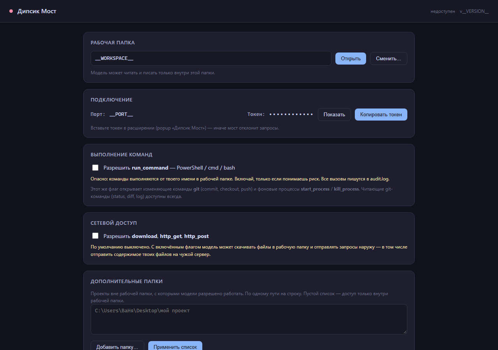

# Дипсик Мост

**Мост между веб-чатом DeepSeek и вашим компьютером.** Модель в браузере получает настоящие
инструменты: читать и править файлы, искать по коду, запускать команды, снимать скриншоты —
и **видеть** результат своей работы.

Веб-версия DeepSeek не умеет вызывать инструменты: у неё нет tool-calling, как у API. Этот
проект даёт ей их обходным путём — через браузерное расширение и локальный HTTP-мост.



---

## Как это работает

```
┌──────────────────────┐        ┌───────────────────────┐        ┌──────────────────┐
│  chat.deepseek.com   │        │  Расширение (MV3)     │        │  Мост (Node.js)  │
│                      │        │                       │        │  127.0.0.1:8443  │
│  Модель пишет блок:  │        │  • находит блоки      │  HTTP  │                  │
│  ```dsbridge         │ ─────► │  • шлёт в мост        │ ─────► │  • 40 инструментов│
│  {tool, args}        │        │  • рисует карточки    │        │  • path jail     │
│  ```                 │ ◄───── │  • вставляет ответ    │ ◄───── │  • аудит вызовов │
│                      │        │  • прикрепляет png    │        │                  │
└──────────────────────┘        └───────────────────────┘        └────────┬─────────┘
                                                                          │
                                                                  ваша рабочая папка
```

1. Вы один раз вставляете в чат **инструкцию для модели** — она объясняет, как вызывать инструменты.
2. Модель вместо ответа пишет блок кода с языком `dsbridge` и JSON внутри.
3. Расширение ловит блок, отправляет его на локальный мост, тот выполняет вызов у вас на диске.
4. Результат возвращается в чат. Если инструмент сделал картинку — она **прикрепляется к сообщению**,
   и модель её действительно видит.

Никаких облаков и API-ключей: мост слушает только `127.0.0.1` и проверяет токен на каждом запросе.

## Что умеет

**40 инструментов** — список всегда можно посмотреть в `/api/tools` или в [руководстве](docs/manual.md#инструменты).

| Группа | Что есть |
|---|---|
| Файлы | `list_dir`, `tree`, `read_file` (с определением кодировки), `read_lines`, `read_around`, `write_file`, `edit_file`, `edit_many`, `write_binary`, `move`, `copy`, `delete` (в корзину), `stat` |
| Поиск и сравнение | `search`, `grep` (с контекстом и glob), `hash`, `diff` (свой LCS), `diff_git` |
| Система | `sysinfo`, `run_command`, `git`, `start_process`, `list_processes`, `process_logs`, `kill_process`, `find_tool` |
| Картинки | `screenshot` (страница / окно / экран, `fullPage`, `dark`, пресеты устройств), `image_info`, `list_windows` |
| Сеть* | `download`, `http_get`, `http_post` |
| Прочее | `zip`, `unzip`, `batch` (до 50 вызовов за раз), `remember` / `recall` / `forget` (память между чатами), `usage_stats` |

\* Сетевые инструменты выключены по умолчанию и включаются флагом.

Отдельно стоит отметить:

- **Зрение.** `screenshot` + прикрепление картинки к чату — модель проверяет вёрстку сама,
  а не догадывается, что получилось.
- **`edit_many`** — до 100 точечных правок в файле одним вызовом, атомарно: не вышло хоть что-то —
  файл не меняется. Есть `dry_run`.
- **`batch`** — несколько инструментов за один round-trip, экономит лимит «Слишком частые сообщения».
- **Память.** `remember` пишет в `~/.dsbridge/memory.json`, и заметка доступна в следующем чате.

## Быстрый старт

Нужен **Node.js 20+** и браузер на Chromium (Chrome, Edge, Яндекс, Brave).

**1. Запустить мост**

```bash
cd bridge
node src/server.mjs
```

Откроется веб-UI на `http://127.0.0.1:8443` — там видно рабочую папку, токен и флаги.
При первом запуске создаётся `~/.dsbridge/config.json`.

**2. Установить расширение**

1. `chrome://extensions` → включить «Режим разработчика».
2. «Загрузить распакованное расширение» → папка `extension/`.
3. Открыть иконку расширения, вставить токен из веб-UI моста, «Сохранить и проверить».

**3. Начать работать**

1. Открыть `https://chat.deepseek.com/` — справа снизу появится панель «Дипсик Мост».
2. Нажать **«Вставить инструкцию для модели»** и отправить сообщение.
3. Попросить, например: «прочитай `notes.md` и найди в проекте все TODO».

Модель ответит блоком:

````dsbridge
{ "tool": "grep", "args": { "pattern": "TODO", "path": ".", "glob": "*.js" } }
````

Панель выполнит вызов и покажет карточку результата.

> Готовый `.exe` (Node внутри, ставить ничего не нужно) собирается командой `cd bridge && node build.mjs`.

## Безопасность

Мост запускается на вашей машине и умеет запускать команды — поэтому ограничений несколько:

- **Только localhost.** Слушает `127.0.0.1`, снаружи недоступен.
- **Токен на каждом запросе.** Лежит в `~/.dsbridge/config.json`, без него — `401`.
- **Path jail.** Любой путь проверяется: выйти за рабочую папку нельзя (`EPATHJAIL`).
  Дополнительные папки добавляются явным списком `extraRoots`.
- **`delete` не удаляет.** Переносит в `<workspace>/.trash/`, откуда файл можно вернуть.
- **Флаги.** «Выполнение команд» и «Сетевой доступ» включаются отдельно; при выключенном флаге
  инструмент отвечает `EDISABLED`, а не делает вид, что сработал.
- **Аудит.** Каждый вызов пишется в `~/.dsbridge/audit.log`.

Подробнее — [Безопасность](docs/manual.md#безопасность).

## Структура проекта

```
bridge/                  мост: HTTP-сервер и инструменты (Node.js, только stdlib)
  src/server.mjs           маршруты, авторизация, SSE
  src/tools.mjs            реестр TOOLS и все инструменты
  src/security.mjs         path jail, extraRoots, зарезервированные имена Windows
  src/shell.mjs            запуск команд и фоновых процессов
  src/browser.mjs          headless-скриншоты через установленный Chromium
  src/net.mjs              download / http_get / http_post
  src/config.mjs           конфиг и переменные окружения
  src/logger.mjs           аудит вызовов
  src/assets.mjs           единственное место, знающее о файлах проекта (нужно для .exe)
  public/index.html        веб-UI моста
  scripts/                 PowerShell-хелперы: скриншот окна, список окон
  build.mjs                сборка одного .exe: свой ESM→CJS бандлер + Node SEA
  test.mjs                 197 проверок
extension/               расширение (MV3, чистый JS — без сборки)
  background.js            service worker: запросы к мосту
  content.js               панель, разбор блоков, очередь вызовов, «зрение»
  popup.html / popup.js    токен и рабочая папка
  render-instruction.mjs   рендер промта в текст — чтобы вычитать без браузера
  test.mjs                 49 проверок
docs/manual.md           полное руководство
CHANGES.md               журнал изменений: что и зачем менялось
roadmap.md               план развития
wishlist3.txt            пожелания, написанные самой моделью после работы через мост
```

## Разработка

```bash
cd bridge      && node test.mjs        # 197 проверок: инструменты, jail, авторизация, SSE
cd extension   && node test.mjs        # 49 проверок: чистые функции content.js
cd bridge      && node build.mjs       # собрать dist/dsbridge.exe и проверить его запуском
node extension/render-instruction.mjs  # → INSTRUCTION.preview.md: текст промта для вычитки
```

Тесты пишут в изолированные `.test-data/` и `.test-workspace/`, боевой `~/.dsbridge/` не трогают.
`build.mjs` после сборки **сам запускает exe** в чистой временной папке и дёргает health, UI,
запись-чтение файла и скриншот — «сборка прошла успешно» без этой проверки ничего не значит.

Инструкция для модели, которую расширение вставляет в чат, **не написана руками**: список
инструментов собирается из реестра моста (`/api/tools`), поэтому промт не может разъехаться
с кодом. Тест сверяет их и упадёт, если новый инструмент не доедет до промта.

## Документация

- [**Полное руководство**](docs/manual.md) — все инструменты с примерами, API моста, флаги,
  коды ошибок, сборка exe, внутренности расширения.
- [CHANGES.md](CHANGES.md) — что и когда менялось.
- [roadmap.md](roadmap.md) — что планируется.
- [wishlist3.txt](wishlist3.txt) — список пожеланий, написанный **самой моделью** после работы
  через мост. Хорошо показывает, чего не хватало на практике.
- [docs/manual.md#инструкция-для-модели](docs/manual.md#инструкция-для-модели) — как устроен промт.

## Известные ограничения

- **Парсинг DOM `chat.deepseek.com` не проверялся на живом сайте.** Разбор блоков и вставка
  в React-поле написаны по коду; в панели есть диагностика («блоков на странице · вызовов»)
  и кнопка «DOM». Это главный риск проекта.
- **Только Windows.** Мост использует PowerShell для скриншотов, зарезервированных имён и части
  системных вызовов. Ядро (файлы, поиск, git) кроссплатформенное, но остальное — нет.
- **Интерактивного браузера нет.** Скриншоты делаются headless-запуском Chromium, кликать и
  заполнять формы модель пока не умеет.
- При обновлении расширения связь рвётся: вызов вернёт `EBRIDGE`. Файлы на диске целы — надо
  подождать и повторить.

## Лицензия

Пока не выбрана. До её появления все права сохраняются за автором — если планируете использовать
код, напишите issue.
